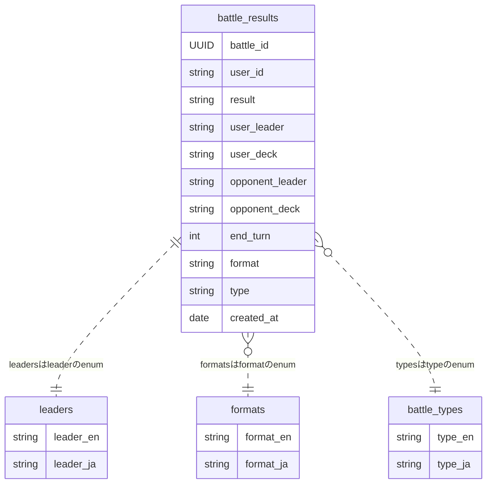

## 必要なテーブル

- バトル結果テーブル
- 使用者テーブル?

## 各テーブルに必要な要素

1. バトル結果テーブル
   - バトル結果 ID
   - 使用者 ID
   - 勝敗
   - 使用者リーダ名
   - 使用者デッキ名
   - 対戦相手リーダ名
   - 対戦相手デッキ名
   - 経過ターン数
   - フォーマット
   - ランクかフリーか
   - 作成日時

## ER

